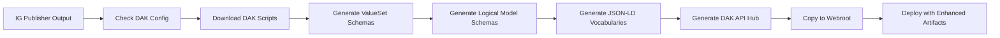

# Enhanced Release Workflow with DAK Processing

This enhanced release workflow provides complete DAK (Digital Adaptation Kit) processing capabilities, ensuring that SMART Guidelines implementation guides include all the modern API documentation, JSON schemas, and semantic web features.

## Overview

The enhanced release workflow bridges the gap between the basic FHIR IG Publisher and the comprehensive DAK processing pipeline used in smart-base. It ensures that released implementation guides include:

- ✅ **JSON Schemas** for ValueSets and Logical Models
- ✅ **JSON-LD Vocabularies** for semantic web integration  
- ✅ **OpenAPI Documentation** with comprehensive API hub
- ✅ **DMN Questionnaire Generation** from decision tables
- ✅ **Comprehensive QA Reporting** for all processing steps

## Quick Start

### 1. Add the Enhanced Workflow

Copy the enhanced `release.yml` to your repository's `.github/workflows/` directory:

```yaml
# .github/workflows/release.yml
name: Release IG with DAK Processing

on:
  release:
    types: [published]
  workflow_dispatch:
    inputs:
      sitepreview_dir:
        description: 'Site preview directory name'
        required: false
        default: 'sitepreview'

jobs:
  release:
    uses: costateixeira/smart-html/.github/workflows/release-enhanced.yml@main
    with:
      pubreq_package_id: "your.package.id"
      pubreq_version: ${{ github.event.release.tag_name || 'dev' }}
      pubreq_canonical: "http://your.domain/your-ig" 
      pubreq_path: "/your-ig"
      sitepreview_dir: ${{ github.event.inputs.sitepreview_dir || 'sitepreview' }}
      do_dak: true  # Enable DAK processing
    secrets: inherit
```

### 2. Add Release Configuration

Create a `release-config.yaml` file in your repository root:

```yaml
# Enable DAK processing for this repository
dak:
  enabled: true

# Configure your IG publication details
publication:
  canonical: "http://your.domain/your-ig"
  package_id: "your.package.id"
```

### 3. Enable DAK Processing (One of the following)

**Option A:** Add a `dak.json` file to your repository root:
```json
{
  "resourceType": "DAK", 
  "id": "your.ig.id",
  "name": "YourIGName",
  "title": "Your IG Title",
  "version": "1.0.0"
}
```

**Option B:** Add smart.who.int.base as a dependency in `sushi-config.yaml`:
```yaml
dependencies:
  smart.who.int.base: current
```

## What Gets Generated

### During Standard IG Publishing
- **Standard FHIR IG**: Complete implementation guide with all FHIR resources
- **FHIR Artifacts**: ValueSets, StructureDefinitions, etc.
- **Standard Documentation**: HTML pages for all resources

### During DAK Post-Processing
- **JSON Schemas**: `ValueSet-*.schema.json`, `StructureDefinition-*.schema.json`
- **JSON-LD Vocabularies**: `ValueSet-*.jsonld` with semantic web definitions
- **OpenAPI Documentation**: `.openapi.json` files for all schemas
- **DAK API Hub**: Comprehensive `dak-api.html` page with all API documentation
- **QA Reports**: Detailed processing reports in `qa.json`

### Deployment Structure
```
sitepreview/
├── index.html                    # Main IG page
├── artifacts.html                # FHIR artifacts 
├── dak-api.html                  # 🆕 DAK API documentation hub
├── ValueSet-*.html               # Standard FHIR pages
├── ValueSet-*.schema.json        # 🆕 JSON schemas
├── ValueSet-*.jsonld            # 🆕 JSON-LD vocabularies
├── ValueSet-*.openapi.json      # 🆕 OpenAPI specs
├── StructureDefinition-*.html    # Standard FHIR pages
├── StructureDefinition-*.schema.json # 🆕 Logical model schemas
└── qa.json                       # 🆕 Comprehensive QA report
```

## Advanced Configuration

### Custom Script Configuration

```yaml
# release-config.yaml
dak:
  enabled: true
  
  scripts:
    # Override default script source
    source_repo: "https://github.com/YourOrg/custom-dak-scripts"
    source_branch: "main"
    
    # Customize which scripts run
    preprocessing:
      - "dmn_questionnaire_generator.py"
      - "custom_preprocessing.py"  # Your custom script
    
    postprocessing:
      - "generate_valueset_schemas.py"
      - "generate_jsonld_vocabularies.py"
      - "custom_postprocessing.py"  # Your custom script

  # Custom output configuration  
  output:
    preserve_patterns:
      - "*.schema.json"
      - "*.jsonld"
      - "custom-*.json"
```

### Repository-Specific Overrides

```yaml
# .github/release-config.yaml (takes precedence over root file)
dak:
  enabled: true
  
github:
  enable_pr_creation: false  # Disable PRs for this repo
  
build:
  java_memory: "8g"  # More memory for large IGs
  
deployment:
  sitepreview_dir: "custom-preview"
  exclude:
    - "large-files/"
    - "debug-output/"
```

## Troubleshooting

### DAK Processing Not Running

Check these common issues:

1. **Missing DAK enablement**: Ensure you have either `dak.json` or `smart.who.int.base` dependency
2. **Wrong input parameter**: Set `do_dak: true` in workflow call
3. **Missing configuration**: Add `release-config.yaml` with `dak.enabled: true`

### Missing Artifacts in Output

1. **Check workflow logs**: Look for "DAK post-processing" section in GitHub Actions
2. **Verify IG Publisher success**: DAK processing only runs if IG Publisher succeeds
3. **Check exclusion patterns**: Ensure files aren't excluded by `deployment.exclude`

### Script Download Failures

1. **Check network connectivity**: Scripts download from GitHub during workflow
2. **Verify repository access**: Ensure smart-base repository is accessible
3. **Check script availability**: Some scripts may not exist in older smart-base versions

### Performance Issues

1. **Increase timeouts**: Modify `build.timeouts` in configuration
2. **Optimize memory**: Increase `build.java_memory` for large IGs  
3. **Use sparse checkout**: Enable `sparse_checkout.enabled: true`

## Comparison with Standard Workflow

| Feature | Standard release.yml | Enhanced release.yml |
|---------|---------------------|---------------------|
| Basic IG Publishing | ✅ | ✅ |
| JSON Schemas | ❌ | ✅ |
| JSON-LD Vocabularies | ❌ | ✅ |
| OpenAPI Documentation | ❌ | ✅ |
| DAK API Hub | ❌ | ✅ |
| DMN Processing | ❌ | ✅ |
| Comprehensive QA | ❌ | ✅ |
| Processing Time | ~5-10 min | ~15-25 min |
| Output Size | Standard | +20-50% (schemas/APIs) |

## Migration Guide

### From Standard release.yml

1. **Backup existing workflow**: Save your current `.github/workflows/release.yml`
2. **Replace with enhanced version**: Use the enhanced workflow file
3. **Add configuration**: Create `release-config.yaml` in repository root
4. **Enable DAK**: Add `dak.json` or smart-base dependency
5. **Test workflow**: Run a test release to verify all artifacts generate

### From ghbuild.yml  

1. **Keep ghbuild for development**: Continue using `ghbuild.yml` for branch builds
2. **Add release workflow**: Use enhanced `release.yml` for releases
3. **Sync configurations**: Ensure both workflows use similar settings
4. **Update documentation**: Point release links to new sitepreview location

## Files in this Package

### Workflow Files
- `.github/workflows/release-enhanced.yml` - Enhanced release workflow with DAK processing
- Original `release.yml` - Backup for reference

### Scripts
- `scripts/dak_processor.py` - Standalone DAK post-processing script
- `scripts/release-config-dak.yaml` - Example configuration with DAK support

### Documentation
- `README-DAK-RELEASE.md` - This comprehensive guide
- `MIGRATION-GUIDE.md` - Step-by-step migration instructions

## Architecture

### Workflow Stages


### DAK Processing Flow



## Support

For issues with the enhanced release workflow:

1. **Check logs**: Review GitHub Actions workflow logs for specific errors
2. **Validate configuration**: Ensure `release-config.yaml` syntax is correct
3. **Test components**: Try running individual DAK scripts locally
4. **Report issues**: Open issues in the smart-html or smart-base repositories

## Contributing

To improve the enhanced release workflow:

1. **Submit PRs**: Contribute to smart-html repository for workflow improvements
2. **Add scripts**: Contribute new DAK processing scripts to smart-base
3. **Update documentation**: Help improve this README and troubleshooting guides
4. **Share configurations**: Share working configurations for different repository types

## License

This enhanced release workflow is provided under the same license as the smart-html repository. See the main repository LICENSE file for details.

## Version History

- **v1.0.0** - Initial enhanced release workflow with DAK processing
- **v1.1.0** - Added comprehensive error handling and artifact management
- **v1.2.0** - Improved configuration system and documentation

---

For the latest version and updates, see the [smart-html repository](https://github.com/costateixeira/smart-html).
